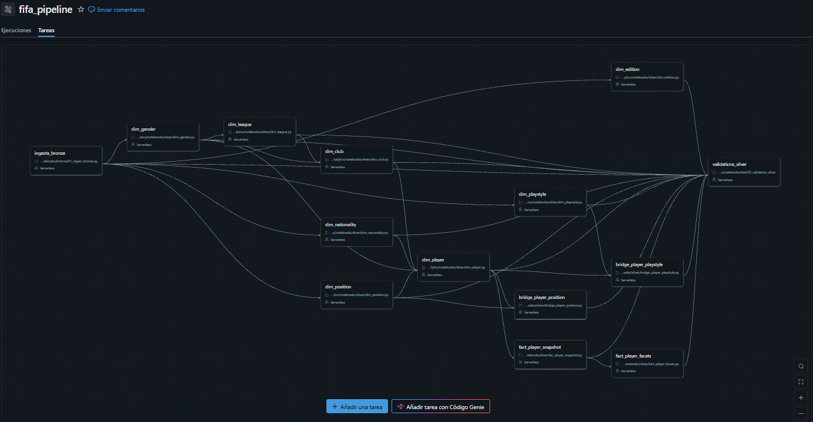

## Orchestration

The pipeline runs as a single **Databricks Job** with 14 tasks and a dependency DAG. Each task runs a notebook in the correct order, ensuring that dimensions are built before facts and bridges.

**Task dependencies:**

- `ingest_bronze` is the entry point. It has no dependencies and must run first.
- `dim_edition`, `dim_gender`, `dim_position`, and `dim_nationality` depend only on `ingest_bronze`. They can run in parallel.
- `dim_playstyle` depends only on `ingest_bronze`.
- `dim_league` depends on `dim_gender`.
- `dim_club` depends on `dim_gender` and `dim_league`.
- `dim_player` depends on `dim_gender`, `dim_position`, `dim_nationality`, and `dim_club`.
- `bridge_player_position` depends on `dim_player` and `dim_position`.
- `bridge_player_playstyle` depends on `dim_player` and `dim_playstyle`.
- `fact_player_snapshot` depends on `dim_player`.
- `fact_player_facets` depends on `fact_player_snapshot`.
- `validations_silver` depends on all the previous tasks. It runs last.

**Why this order?**

- `ingest_bronze` is the entry point: nothing runs until raw data is in Bronze.
- SCD1 dimensions (`dim_edition`, `dim_gender`, `dim_position`, `dim_nationality`) have no dependencies between them.
- `dim_league` depends on `dim_gender`.
- `dim_club` depends on `dim_gender` and `dim_league`.
- `dim_player` depends on `dim_gender`, `dim_position`, `dim_nationality`, and `dim_club`.
- Bridge and fact tables depend on `dim_player`.
- `validations_silver` runs at the end, after all transformations.