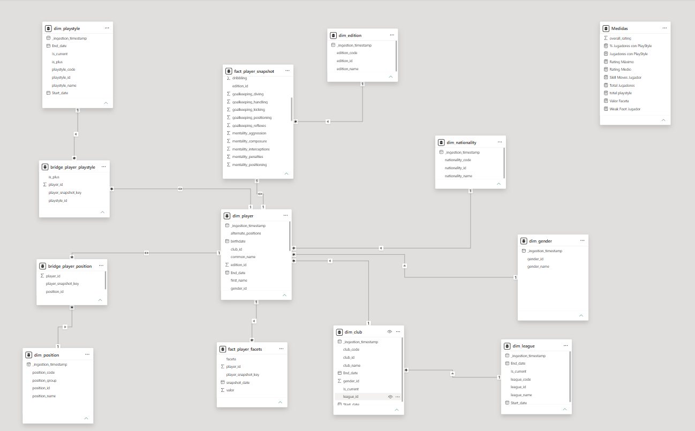
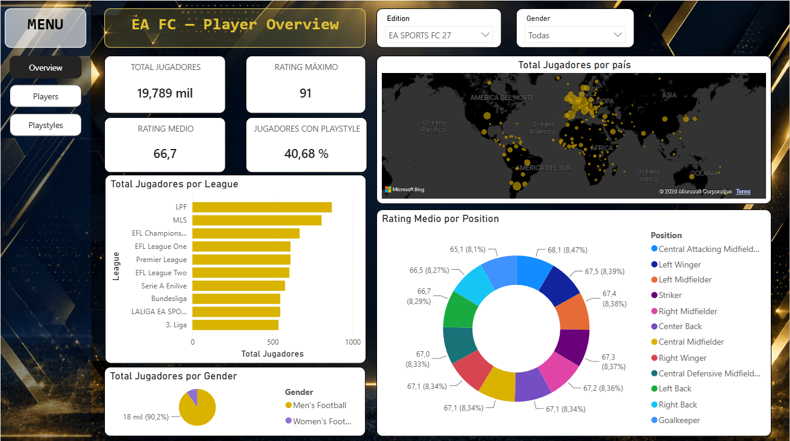
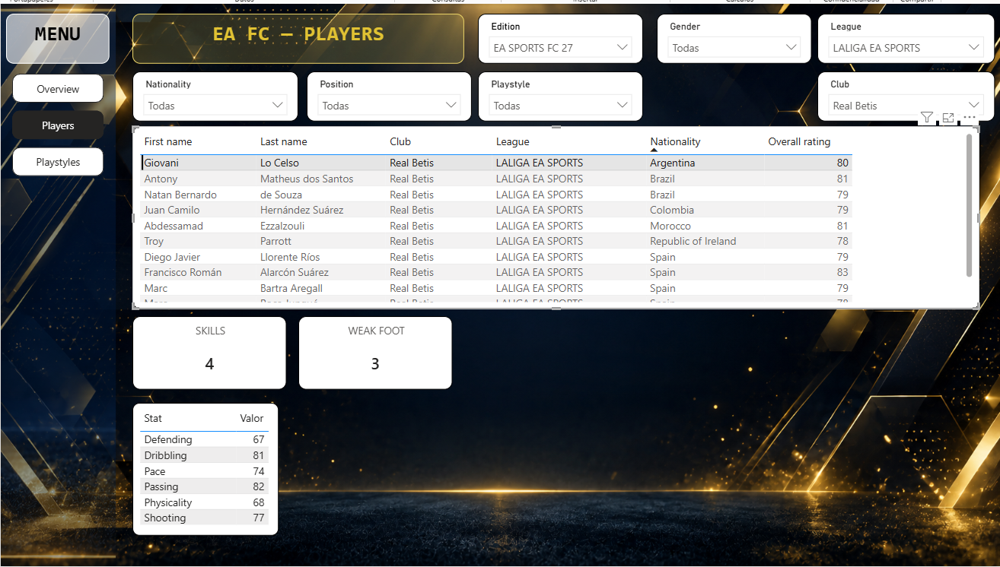
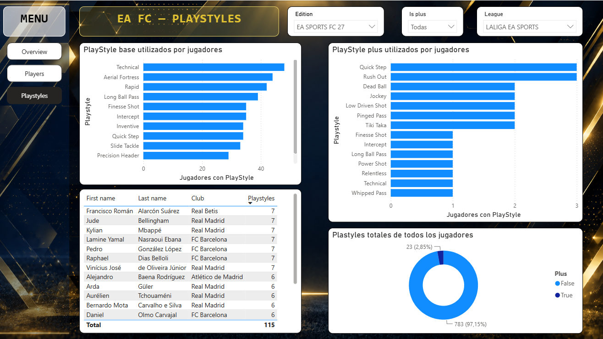

# Power BI Dashboard — EA FC Player Analytics

Interactive Power BI dashboard built on top of the `fifa.silver` schema in Databricks. It exposes three pages: Overview, Players, and PlayStyles.

---

## Connection

Power BI connects to Databricks using **OAuth authentication**.

### Steps to connect

1. Open Power BI Desktop.
2. **Get Data** → **Databricks**.
3. Enter the **Server Hostname** and **HTTP Path** of your SQL Warehouse.
4. Select **OAuth** as the authentication method.
5. Sign in with your Databricks account.
6. Select the tables from the `fifa.silver` schema.

### Tables imported

| Table | Type | Purpose |
|---|---|---|
| `dim_player` | Dimension | Player descriptive attributes |
| `dim_edition` | Dimension | Game editions |
| `dim_gender` | Dimension | Gender categories |
| `dim_position` | Dimension | Positions |
| `dim_nationality` | Dimension | Nationalities |
| `dim_league` | Dimension | Leagues |
| `dim_club` | Dimension | Clubs |
| `dim_playstyle` | Dimension | PlayStyles |
| `bridge_player_position` | Bridge | Player ↔ positions (M:N) |
| `bridge_player_playstyle` | Bridge | Player ↔ playstyles (M:N) |
| `fact_player_snapshot` | Fact | Per-snapshot metrics |
| `fact_player_facets` | Fact | Long-format facets (radar chart) |

---

## Data Model

### Relationships

The model follows a **Snowflake Schema** with bridge tables for many-to-many relationships:

### Key design decisions

- **`player_snapshot_key`**: composite key (`player_id + snapshot_date`) used to link `dim_player` with `fact_player_snapshot`, `bridge_player_position`, `bridge_player_playstyle`, and `fact_player_facets`.
- **Bridge tables**: resolve the many-to-many relationships between players and positions/playstyles.

---

## Pages

### Page 1: Overview

**Purpose**: high-level KPIs and distributions.

**Visuals**:

| Visual | Fields |
|---|---|
| KPI Cards | Total Players, Average Rating, Max Rating, % with PlayStyle |
| Bar chart | Top 10 leagues by player count |
| Donut chart | Distribution by gender |
| Map | Players by nationality |
| Bar chart | Average rating by position |

**Slicers**: Edition, Gender.

### Page 2: Players

**Purpose**: explore individual player attributes.

**Visuals**:

| Visual | Fields |
|---|---|
| Table | Top players (name, club, league, nationality, rating) |
| Cards | Skill Moves, Weak Foot |
| Table | Facets (Pace, Shooting, Passing, Dribbling, Defending, Physicality) |

**Behavior**:
- When no player is selected, the Skills, Weak Foot, and Facets visuals show an empty state (`--`).
- When a player is selected, the visuals update with that player's data.

**Slicers**: Edition, League, Gender, Position, Club, Nationality, Playstyle.

### Page 3: PlayStyles

**Purpose**: analyze the PlayStyles catalog.

**Visuals**:

| Visual | Fields |
|---|---|
| Bar chart | Top 10 base PlayStyles |
| Bar chart | Top 10 PlayStyles+ |
| Table | Players with most PlayStyles |
| Donut chart | Base vs Plus distribution |

**Slicers**: Edition, League, Is Plus.

---

## DAX Measures

Key measures used in the dashboard:

| Measure | Description |
|---|---|
| `overall_rating` | Not a measure — it's a column from `fact_player_snapshot`. |
| `% Jugadores con PlayStyle` | Percentage of players with at least one PlayStyle, over the total number of players. |
| `Jugadores con PlayStyle` | Distinct count of players with at least one PlayStyle. |
| `Rating Máximo` | Highest rating in the latest snapshot. |
| `Rating Medio` | Average rating in the latest snapshot. |
| `Skill Moves Jugador` | `skill_moves` value of the selected player. Returns blank if no player is selected. |
| `Total Jugadores` | Distinct count of players in `dim_player`. |
| `total playstyle` | Count of rows in `bridge_player_playstyle` (player + playstyle combinations). |
| `Valor Faceta` | Facet value (Pace, Shooting, ...) of the selected player. Returns blank if no player is selected. |
| `Weak Foot Jugador` | `weak_foot` value of the selected player. Returns blank if no player is selected. |
